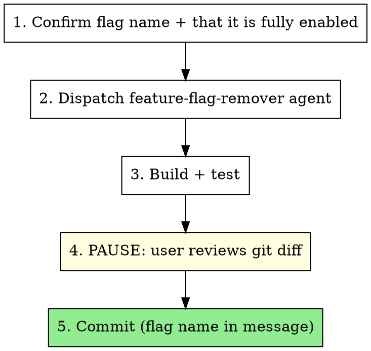

# Remove Feature Flag

Deletes a rolled-out feature flag and collapses its conditional logic to the enabled path.

**Core assumption:** the flag is being removed *because it is fully on*. The enabled branch is the code that survives; the disabled branch is dead code. If that is not the case for this flag, stop and confirm with the user before touching anything — removing a flag that is off means deleting the shipped behavior.

**Usage:** `/remove-feature-flag <FlagName>`. If no flag name was supplied, ask for one rather than guessing from recent changes.

## Workflow

### 1. Establish the target

Confirm the exact flag identifier (constant name and string value — they often differ). Confirm with the user that the flag is fully enabled in every environment that matters, unless they have already said so.

Handle one flag per invocation. Batching flag removals makes the diff unreviewable and couples unrelated risks.

### 2. Dispatch the agent

Dispatch `dotnet-dev:feature-flag-remover` with the flag's constant name and string value. The agent owns the search-and-edit sweep across production code, Blazor markup, and tests; it runs in its own context because the grep fan-out is large and mostly irrelevant to the main thread.

### 3. Verify mechanically

Build, run the test suite, then grep the whole repo for both the constant name and the raw string. A leftover reference in a comment, a config file, or a test fixture name is the usual miss.

### 4. Diff gate — stop here

Present the diff and **wait for the user's approval before committing.** Do not skip this step or fold it into the commit; flag removal deletes code, and a wrong assumption about which branch was live is only visible in the diff.

Draw the user's attention to anything where the collapse was not purely mechanical: a compound condition that had to be re-reasoned, a nested flag, a test that covered both states.

### 5. Commit

Commit the removal on its own, with the flag name in the message for traceability. Nothing unrelated in the same commit.

Then remind the user to archive or delete the flag in the flag provider — LaunchDarkly, Unleash, Azure App Configuration — which is outside the codebase and cannot be done from here.

## Red flags

Stop and ask if you hit any of these:

* The flag's disabled branch appears to be the live behavior.
* The flag guards a data migration, a schema change, or a destructive operation.
* Removing it leaves a method, class, or injected service with no remaining callers — deletion may be correct, but confirm rather than cascade.
* Committing without the user having seen the diff. That is never correct here.
