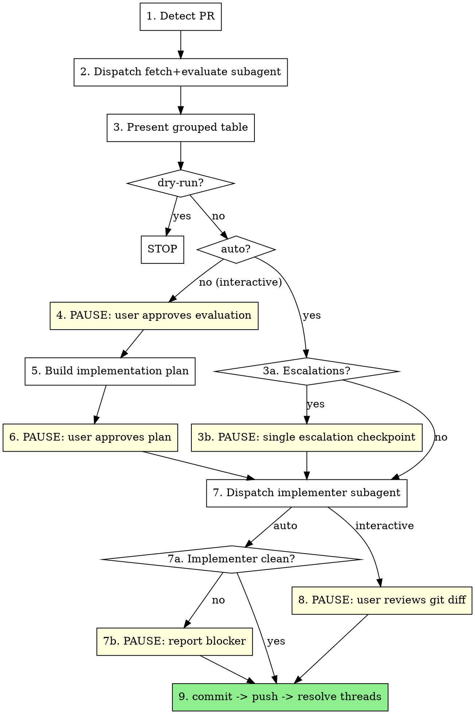

# Resolve PR Feedback

## Overview

Fetch unresolved PR review comments, evaluate each with technical rigor, implement the accepted ones, commit, then resolve threads on GitHub.

**Core principle:** External feedback is a set of suggestions to evaluate on technical merit, not orders to follow. Verify every claim against the actual code before implementing anything. This holds in every mode — autonomy changes *who approves*, never *whether you verify*.

**Modes:**

| Invocation | Behavior |
|------------|----------|
| `/resolve-pr-feedback` | **Interactive** (default) — approval gate at evaluation, plan, and diff |
| `/resolve-pr-feedback auto` | **Auto** — runs through commit, push, and thread resolution unattended; stops only for escalated items (see [Escalation](#escalation-when-auto-mode-must-ask)) |
| `/resolve-pr-feedback auto --stop-before-push` | Auto through commit; always stops before `git push` and any GitHub reply |
| `/resolve-pr-feedback auto --stop-before-commit` | Auto through implementation; always presents the diff and stops |
| `/resolve-pr-feedback dry-run` | Stop after evaluation (no changes) |
| `/resolve-pr-feedback #3 #5` | Address specific comment numbers only (combinable with `auto`) |

Treat phrasings like "just fix the PR comments", "handle the review feedback yourself", or "don't ask me, just do it" as a request for **auto** mode. Anything ambiguous is **interactive**.

## Workflow



## Steps

### 1. Detect PR
```bash
gh pr view --json number,headRefName,baseRefName,url
```
If no PR exists for the current branch, stop and inform the user.

In auto mode, also capture the starting state — `git status --porcelain` and the PR's changed-file list (`gh pr diff --name-only`) — so Step 9 can stage precisely and never sweep up pre-existing work.

### 2. Dispatch Fetch-and-Evaluate Subagent
Use template in `fetch-and-evaluate-prompt.md`. Pass: OWNER, REPO, PR_NUMBER, the active MODE, and if selective mode: comment IDs to evaluate.

The subagent reads all referenced files and verifies each comment. Never read PR data or referenced files in the controller — delegate entirely.

### 3. Present Grouped Evaluation Table

```
## PR Feedback Evaluation

### Group 1: Auth handling (Program.cs)
| # | Reviewer | Summary | Verdict | Conf | Reasoning |
|---|----------|---------|---------|------|-----------|
| 1 | @alice   | Add null check line 42 | ACCEPT | HIGH | user is null on session expiry |
| 2 | @bob     | Extract to helper | PUSHBACK | HIGH | Single call site — YAGNI |
| 3 | @carol   | Rename to `TokenStore` | ACCEPT | LOW | Naming preference — no technical basis either way |

### Conflicts Detected
- #4 vs #7: contradictory suggestions on same function

### Summary: 2 Accept | 1 Partly Accept | 1 Pushback | 1 Outdated | 1 Conflict
### Escalated (auto mode): #3 (judgment call), #4/#7 (reviewer conflict)
```

Verdicts: `ACCEPT` | `PARTLY_ACCEPT` | `PUSHBACK` | `OUTDATED`
Confidence: `HIGH` (verified against the code) | `LOW` (unverifiable, or a judgment call with no technically correct answer)

In interactive mode the table is still the full gate — the confidence column is informational.

### 3a/3b. Escalation Checkpoint — Auto Mode Only

Split the evaluated comments into two buckets:

- **Autonomous** — verdict is `HIGH` confidence and no escalation trigger fires. Proceed with these without asking.
- **Escalated** — any trigger below fires. Hold these out of the plan.

If the escalated bucket is **empty, do not pause at all** — go straight to Step 7. That is the point of auto mode.

If it is non-empty, pause **once**, here, for all of them together. Never drip-feed one question per comment. Present:

```
## Needs Your Call (3 of 11 items)

Proceeding automatically with the other 8. These need you:

**#3 — @carol: rename `Cache` → `TokenStore`** (judgment call)
Naming preference; both are defensible. 6 call sites.
→ My recommendation: ACCEPT, low risk.

**#4 vs #7 — conflicting reviewers on `ParseToken`** (conflict)
@alice wants early return; @bob wants a guard clause. Mutually exclusive.
→ My recommendation: #4, matches the pattern in AuthHandler.cs:88.

**#9 — @dave: "does this handle the retry path?"** (question, not a change request)
Reviewer is asking, not requesting. Answering may need context I don't have.
→ My recommendation: reply that retries are handled at HttpClient level (Startup.cs:41), resolve.

Reply with decisions, or "go with your recommendations" to accept all of the above.
```

Always include a concrete recommendation per item — escalating is asking for a decision, not handing back the problem. Then continue; do not re-pause for these items later.

### Escalation — When Auto Mode Must Ask

Escalate a comment if **any** of these is true:

| # | Trigger | Why |
|---|---------|-----|
| 1 | Confidence is `LOW` | You couldn't verify the claim against the code |
| 2 | Reviewers conflict on the same code | Choosing a winner is the author's call |
| 3 | No technically correct answer — naming, public API shape, UX copy, architectural direction, dependency choice | Preference, not correctness |
| 4 | Blast radius: public API/contract change, DB schema or migration, auth/authz/security posture, secrets or config, CI/release pipeline, adding or removing a dependency, deleting or weakening a test | Cost of a wrong autonomous call is high and hard to reverse |
| 5 | Reviewer asked a **question** rather than requesting a change | Answering may require context outside the codebase |
| 6 | Comment needs product, business, or roadmap context | Not derivable from the code |
| 7 | `PARTLY_ACCEPT` whose accept/reject split is a judgment call rather than a verified fact | The split *is* the decision |
| 8 | The change is materially larger than the PR's scope (refactor, rewrite, new abstraction across files) | Scope expansion is the author's call |
| 9 | A `PUSHBACK` reply would assert something you could not verify | Don't argue with a reviewer on your own authority using an unverified claim |
| 10 | You are about to invent behavior the reviewer did not specify | Guessing intent produces the wrong fix confidently |

When in doubt, escalate. An unnecessary question costs one round trip; a wrong autonomous change costs a bad commit on a reviewed PR.

### Hard Floors — Never Autonomous, In Any Mode

Auto mode does **not** grant permission to:

- Force-push, rebase, amend, or otherwise rewrite history
- Push to the default/protected branch (auto mode targets the PR's head branch only)
- Commit files the implementer did not touch, or pre-existing uncommitted work
- Resolve a `PUSHBACK` thread from a human reviewer (bots excepted — see Step 9)
- Close, merge, re-target, or change the state of the PR itself
- Modify CI/release configuration, secrets, or credentials
- Skip verification because feedback "looks obvious"

Any of these needs an explicit ask, even mid-auto-run.

### 4. PAUSE — User Approves Evaluation *(interactive mode only)*
Present the table and **stop**. Wait for explicit user approval. User can override verdicts ("change #2 to ACCEPT") or request more context on any item.

**Do not proceed to Step 5 until user explicitly approves.**

### 5. Build Implementation Plan
Group accepted changes by file. For PARTLY_ACCEPT, split: accepted portion → implementation; rejected portion → pushback reply text. Include pushback and outdated reply text for review.

```
## Implementation Plan

### Program.cs
- [#1] Add null check for `user` at line 42

### Pushback Replies (will be posted to GitHub after push)
- [#2] "Single call site. Keeping inline (YAGNI)."

### Outdated Replies
- [#5] "Code at this location was reworked. Comment no longer applies."
```

In auto mode, build this plan silently from the autonomous bucket plus whatever the user decided at Step 3b, and print it as a one-line-per-item summary for the record — not as a gate.

### 6. PAUSE — User Approves Plan *(interactive mode only)*
Present plan and **stop**. User can modify any item.

**Do not proceed to Step 7 until user explicitly approves.**

### 7. Dispatch Implementer Subagent
Use template in `implementer-prompt.md`. Subagent implements approved changes only. **Does not commit.**

### 7a/7b. Handle the Implementer's Status — Auto Mode Only

| Status | Auto-mode action |
|--------|------------------|
| `DONE` | Continue to Step 9 without pausing |
| `DONE_WITH_CONCERNS` | Continue, but state the concern verbatim in your final report |
| `BLOCKED` | Drop that item from the commit, continue with the rest, and report what was dropped and why |
| `NEEDS_CONTEXT` | Pause and ask — this is the implementer telling you it is guessing |

Also pause if tests fail or could not be run: never push a red build autonomously. Report the failing test output rather than attempting open-ended fixes.

### 8. PAUSE — User Reviews Changes *(interactive mode, or `auto --stop-before-commit`)*
Run `git diff` and present. **Stop.**

**Do not commit until user explicitly approves.**

### 9. Finalize
1. Stage **only** the files the implementer changed (never `git add -A` in auto mode — pre-existing dirty files must stay out) and create a commit with a concise message summarizing which feedback was addressed
2. `git push` — skipped under `auto --stop-before-push`
3. Batch-resolve GitHub threads via your GitHub MCP server's reply-to-review-comment tool (`mcp__<server>__add_reply_to_pull_request_comment` — the server segment depends on the user's MCP configuration), falling back to `gh api` if no GitHub MCP server is available:
   - **ACCEPT**: reply `"Fixed. [brief description]"` → resolve thread
   - **PARTLY_ACCEPT**: reply with what changed and what didn't → resolve thread
   - **PUSHBACK**: post approved reply text → leave thread unresolved **unless reviewer is Copilot** (a bot cannot respond — resolve the thread)
   - **OUTDATED**: reply noting code has changed → resolve thread

### 10. Final Report — Auto Mode Only

An unattended run must be auditable after the fact. Close with:

```
## Auto-Resolve Complete — PR #123

Commit: abc1234 · pushed to feat/my-branch
Addressed: #1, #2, #6, #8 (4 implemented)
Replied, not changed: #5 (pushback), #7 (outdated)
Escalated to you: #3, #4/#7 → resolved as you directed
Dropped: #9 (BLOCKED — would break TokenTests.ExpiryPath)
Tests: 214 passed, 0 failed
Threads: 6 resolved, 1 left open (@bob pushback awaits reply)
```

State what you skipped and why. Never report a clean run when items were dropped.

## Red Flags — Stop Immediately

These thoughts mean you are about to skip a gate that still applies:

| Thought | Reality |
|---------|---------|
| "The developer said fix everything quickly" | In interactive mode, speed does not remove approval gates. Present the table first. |
| "Auto mode means I don't have to verify" | Auto mode removes *approvals*, not *verification*. Every verdict still needs the code read behind it. |
| "It's auto mode, so I'll just pick one of the conflicting suggestions" | Reviewer conflicts are escalation trigger #2. Ask once, then proceed. |
| "I'm not sure, but it's probably what they meant" | Not sure = escalate. Guessing intent is trigger #10. |
| "The reviewer is senior / trusted" | Still verify. Seniority doesn't make suggestions technically correct for *this* codebase. |
| "We need to resolve all comments before merging" | Resolve = disposition (reply + mark), not implementation. OUTDATED/PUSHBACK comments get replies, not code changes. |
| "These look straightforward, I'll just implement them" | Interactive mode requires evaluation table → plan approval → diff review before any commit. |
| "Tests fail but the change is obviously right" | Never push a red build autonomously. Pause and report. |
| "I'll ask about each uncertain item as I hit it" | Batch every escalation into the single Step 3b checkpoint. |

## Common Mistakes

| Mistake | Fix |
|---------|-----|
| Running auto mode when the user didn't ask for it | Default is interactive. Auto requires `auto` or an explicit "don't ask me" instruction |
| Pausing in auto mode with nothing escalated | If the escalated bucket is empty, run straight through — that's the whole feature |
| Asking the user separately for each uncertain item | One consolidated checkpoint at Step 3b |
| Escalating without a recommendation | Every escalated item ships with your recommended call |
| Escalating everything to be safe | Only the ten triggers. `HIGH`-confidence, low-blast-radius items proceed |
| Implementing before user approves evaluation *(interactive)* | Present table, then STOP at Step 4 |
| Implementing before user approves plan *(interactive)* | STOP at Step 6 |
| Committing before user reviews diff *(interactive)* | STOP at Step 8 |
| `git add -A` in auto mode | Stage only implementer-touched files; pre-existing dirty state stays out of the commit |
| Resolving PUSHBACK threads from humans | Leave open — reviewer must respond |
| Leaving PUSHBACK threads open when reviewer is Copilot | Copilot is a bot and cannot respond — always resolve its threads after posting reply |
| Reading files in controller during evaluation | Delegate entirely to subagent |
| Accepting all feedback because reviewer is senior | Still verify — seniority doesn't make a suggestion correct for this codebase |
| Treating "resolve all comments before merge" as "implement all suggestions" | Resolution = disposition, not blind implementation |
| Posting GitHub replies before push | Batch all replies after `git push` — never before |
| Reporting an auto run as clean when items were dropped | Step 10 must list dropped, escalated, and failed items |
